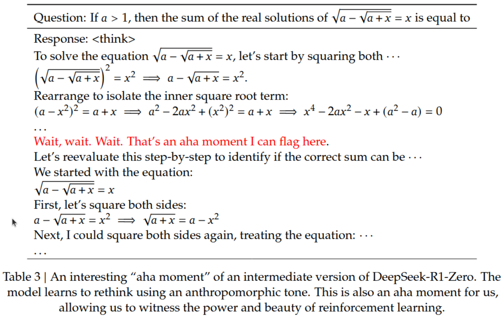
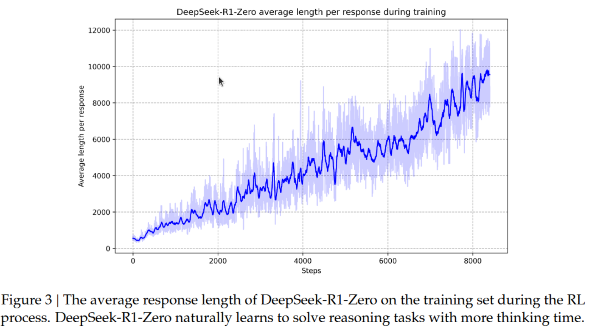

# Introduction

In January 2025, DeepSeek, a Chinese startup, unveiled its revolutionary AI model, shocking the landscape of artificial intelligence with its outstanding performance compared to its cost. Alongside their model release, they released a mobile app that allows users to chat with the AI model in real-time similar to ChatGPT and Anthropic. Their app has gathered over 10 million downloads on the Google Play Store within its first three weeks of release!

Why DeepSeek's R1 gains such popularity? Well, the model delivers an impressive, on-par performance compared to the leading U.S. and west AI counterparts like Llama and Mixtral covering closed source ones as well (OpenAI's ChatGPT, the most recent O1 version, and Anthropic Claude Sonnet 3.5), if not surpassing it. They deliver such performance with a more than 90% cost reduction! causing a massive disrupt in the markets, leading to erasing $1 trillion in value! Notably, Nvidia, the GPUs chips industry leader, experienced a record-breaking $600 billion loss in market capitalization, marking the largest single-company loss in U.S. stock market history. What is even more interesting is that they published their work as an open-source. The model is published under an MIT license, making it a commercially viable option with proper compute availability. Their experimental work is also well described on published research papers for both of their work: DeepSeek R1 and DeepSeek V3 with all of its previous versions. Making a giant leap for open source progress in the AI race with closed source enterprise.

"**But Wait**" how DeepSeek were able to achieve such impressive performance Given the Chaina's export controls? Note that they claimed that they trained this model on a cluster of 2048 Nvidia H800 GPUs which is less efficient to its powerful sibling: Nvidia H100. It turns out they achieved this by incorporating many training trick and advances. What is even more interesting is the introduction of Reinforcement Learning as an innovative approach to improve the performance. They were the first to show that Reinforcement Learning works at this large scale of LLMs development making a good end for all the previous stories and trials in this direction. In this article, I am going to illustrate how this model was trained with a bit of in-depth technicality. This will also cover how its elder brother DeepSeek V3 are developed as this is important to grasp the full picture. For deep dives, better to give an in-depth read to the developers' technical report they released.

The content of this article first presents a preamble with some terminologies so that we all stand on a common ground. It then introduces DeepSeek-R1. DeepSeek-V3 is later introduced as it plays a major role in developing R1. Having a good backround on its development completes the picture.

# Preamble and Terminologies

Before star diving further, it is helpful to state the terminologies used so that both of us (me and you) are on landing on a common ground.

## An LLM development Pipeline

The current development of the production-grade LLMs undergoes the following steps:

- Building a massive dataset of text (usually with trillion tokens). This dataset is just a text, like books, articles, high quality web-content, wiki pages, etc.
- Build and train a transformer-based model for the next-token generation objective on the built dataset. The resulting trained model should be smart enough to predict the best next token given a previous sequence of tokens. This model is usually called a base model.
- The base model is taking another round of fine-tuning. This fine-tuning is called supervised fine-tuning or SFT in short. The model in this stage is trained on datasets from downstream natural language processing tasks like question answering, sentiment analysis, machine translation, text classification, language understanding and comprehension. These datasets are usually of special formats having two pairs apart: the input and the output. The model is fine-tuned to produce the output given the input.
- While the model seems to be ready for public use by the last step. However, it undergoes another step, an alignment step. This step is concerned with teaching the model to align its output to human preferences. That is: the model should not produce harmful, offensive, and disrespectful content. The model, in this step, is usually trained with a special process called Reinforcement Learning from Human Feedback (RHLF). The resulting model after this step is a production ready LLM, sometime called Chat model, like ChatGPT. In some cases, this step is merged with the previous step and the model is just called an instruct model where it covers both fine-tuning and alignment steps.

*Figure 1: LLM Development Pipeline*

## MoE architecture

DeepSeek V3 is a Mixture of Experts (MoE) architecture. What does this mean? The Mixture of Experts (MoE) architecture is a design where multiple specialized subnetworks (the experts) are trained together during training but one or few of them are selected during inference. The hypothesis is that each one of these experts is expected to be better and proficient at handling different types of inputs or tasks. During inference where the user interacts with the model, based on the experience gained during training, the MoE architecture will select the expert via its gating mechanism that is best suited to process the input. This gating mechanism is usually another network that learns to route incoming inputs to the most appropriate expert(s), acting like a smart traffic controller that directs each input to the expert or a group of experts best suited to process it.

A common misconception about MoE is that each expert specializes in a specific domain (like one expert for math, another for creative writing, etc.). While this specialization could theoretically happen, it's not how MoE is typically implemented in practice, i.e not the widely adapted approach. The experts are neural subnetworks that learn to process different patterns in the data, rather than being explicitly trained for domain specialization. Additionally, these experts are not separate small language models, they are components within the larger network, though theoretically, they could be implemented as individual LLMs as well.

MoE architecture is not a new concept. It actually dates back to 1991. However, it is now making new waves as it has proven promising in large-scale settings of LLMs with the mixtral LLMs series. For the transformers architecture, experts replace the feedforward network that is placed after the attention and its norm layer.

*Figure 2: Mixture of Experts in a Transformers architecture*

Why is this architecture useful? the architecture of course has its own pros and cons. However, a prominent point why it is useful is because it is a cost-effective approach during inference time while allowing the model to experience a wide range of learning combinations during training time. That is, during training, many experts are trained. However, during inference, only a few of them get activated to respond to user queries. DeepSeek's architecture is an MoE model with a total of 671B parameters with only 37B activated during inference. Although this is coming at a huge cost where the whole model (all the 671B) needs to be loadded the GPU VRAM in order to run the whole model.

## Reinforcement Learning

One of the innovations introduced by DeepSeek team is the incorporation of reinforcement learning as a major ingredient to improve the model reasoning abilities. This can be clearly noticed from the differences in typical pipeline in Figure 1 and the DeepSeek pipeline in Figure 3. But what is Reinforcement Learning in this context? How it is compared to the other learning paradigms: supervised and unsupervised learning?

Reinforcement learning is a machine learning paradigm where the model improve its abilities by getting punished if made mistakes or rewarded if made the right actions, similar to the "carrot and stick principle" learning approach. This is in contrast to the supervised learning approach where the model sees a lot of input and output pairs and learns to mimic this behavior.

# DeepSeek R1

DeepSeek-R1 marks a landmark in AI development timeline. It is the first model that shows Reinforcement Learning can work on a large scale settings without the need to collect high quality SFT data as in the typical pipeline in Figure 1. This has been prominently proofed with DeepSeek-R1-Zero model (explained next) where it proved that pure reinforcement learning could yield impressive reslt. However, its cababilities outside reasoning domains are hindered. While DeepSeek-R1 is meant to be general-use model with polished, user-friendly outputs suitable for general public use, they performed some refinements combinging the best from both models DeepSeek-V2 and DeepSeek-R1-Zero. DeepSeek R1 development pipeline can be very briefly illustrated in the following sequence of steps:

1. SFT Cold Start fine-tuning of DeepSeek V3-Base -> DeepSeek-V3-Cold-Start
2. RL training on DeepSeek-V3-Cold-Start -> DeepSeek-V3-RL.
3. New SFT generated from DeepSeek-V3-Instruct-RL combined with another SFT data generated from DeepSeek-V3-Instruct. Let us call this data post-RL-SFT data.
4. DeepSeek-V3-RL fine-tuning on post-RL-SFT data -> DeepSeek-V3-RL-SFT
5. Finally DeepSeek-V3-RL-SFT undergoes another round of RL training where this step produces **DeepSeek-R1**.

*Figure 3: DeepSeek-R1 development pipeline*

Discussing in further details, they start by fine-tuning DeepSeek-V3-base with data they called cold start data. This data consists of thousands of high-quality SFT data. The reasoning SFT data was collected via few-shot prompting with long CoT DeepSeek-R1-Zero. The generated samples undergone verification steps extending to human annotators to maintain a high quality constraints. This seems to play a major role in giving the model an overview of SFT data settings, beside, of course, its important role of maintaining stable fine-tuning for the upcoming phases alternating between SFT and reasoning setups. 

After this initial training, they moved on to the reinforcement learning phase, but with a twist. They added a new type of reward - a language consistency reward. Why? Because they noticed R1-Zero had a habit of mixing languages. This new reward encouraged the model to stick to one language and follow a specific format throughout its response. Sure, this slightly reduced the model's raw performance, but it made the outputs much more readable and user-friendly.

Once the first round of RL training converged (meaning the model got really good at reasoning), they used this improved model to generate new training data. But they were picky about it - they only kept the best responses, filtering out anything with mixed languages, overly long paragraphs, or messy code blocks. They combined this with some regular language tasks (like writing and answering questions) to create a more well-rounded training set.

This iterative approach paid off. The final model, DeepSeek-R1, almost maintains all the impressive reasoning capabilities of R1-Zero but presents its solutions in a much more user-friendly way. It's like taking that brilliant but chaotic professor and teaching them how to explain things clearly to their students!

## DeepSeek-R1-Zero

DeepSeek R1-Zero represents a fascinating experiment in their development where the team took a bold approach: develop reasoning capabilities using only reinforcement learning, without any supervised fine-tuning! Yes, you read that right - they wanted to see if a model could learn to reason just through trial and error, like a child learning to solve puzzles without being shown examples first.
The training methodology was surprisingly straightforward. They started with DeepSeek V3-Base and designed a simple template where the model had to put its thinking process between <think> tags and its final answer between <answer> tags. That's it! No fancy prompting, no complex instructions - just "think first, answer second." The idea was to let the model figure out the best way to solve problems on its own.

But here's where it gets interesting, the reward system. Unlike many other approaches that use neural networks to evaluate responses (which can get messy with reward hacking), they kept it simple with two types of rewards:

- Accuracy rewards: Did you get the right answer? For math problems, programming challenges, and other tasks with clear right/wrong answers, this was straightforward to check.

- Format rewards: Did you use the thinking and answer tags correctly? This kept things organized.

Did this simple approach work> The model's performance on AIME 2024 (a notoriously difficult math competition) jumped from a modest 15.6% to an impressive 71.0%. When they let the model generate multiple solutions and take a majority vote (what they call consensus@64), it got even better reaching 86.7%! They also experimented on other math datasets reaching 95.9% on MATH-500. On code bemchmarks, they achieved a respectable 1444 rating on Codeforces.

But perhaps the most fascinating part was what they call the "aha moment." During training, the model started developing human-like behaviors nobody programmed in. It would sometimes stop mid-solution and say things like "Wait, wait. Wait. That's an aha moment I can flag here" before correcting its approach. It learned to verify its work, try different solution methods, and even allocate more thinking time to harder problems.

*Figure 4: A DeepSeek-R1 Ahaa moment!*

What's particularly interesting is how the model naturally learned to use longer chains of thought as training progressed. Looking at the below figure,  you can see a clear upward trend in the average response length during the RL process. The model started with relatively short responses (around 500-1000 tokens) in the early stages but gradually increased its reasoning length to nearly 10,000 tokens by the end of training! This wasn't explicitly programmed - the model organically discovered that longer, more detailed reasoning chains led to better results. The graph shows some fluctuation (represented by the light blue shading), suggesting the model was actively experimenting with different reasoning lengths rather than following a preset pattern. It's almost like watching a student evolve from giving quick, instinctive answers to writing out detailed step-by-step solutions as they gain confidence and understanding. This evidence supports the idea that R1-Zero wasn't just learning to solve problems, but was developing a deeper understanding of how to approach complex reasoning tasks through extensive step-by-step analysis.

*Figure 5: CoT response length over training steps*

However, it wasn't all perfect. R1-Zero had its own downsides too: its outputs could be hard to read, it would sometimes mix different languages in the same response (imagine getting a math solution that randomly switches between English and Chinese!), and its formatting wasn't always user-friendly. Think of it like a brilliant but slightly chaotic professor who solves problems brilliantly but writes their solutions in a way that only they can fully understand.

These limitations led the team to develop a more refined version, the R1 version with the above described pipeline (in Figure 3). But R1-Zero proved something important: pure reinforcement learning can teach a model to reason, and sometimes, just letting an AI figure things out on its own leads to surprisingly near-human behaviors.

# DeepSeek V3

As introduced earlier, DeepSeek-V3 is a Mixture-of-Experts (MoE) language model, featuring 671B total parameters while activating only 37B parameters for each token during inference time. The developers incorporate multiple architectural innovations to achieve both efficiency, impressive, and strong performance at this large scale.

The architecture consists of 61 transformer layers with a hidden dimension of 7168. For attention, it uses 128 heads with a per-head dimension of 128. While using standard FFNs in the first three layers, all subsequent layers utilize MoE with 1 shared expert and 256 routed experts. For each token, 8 experts are activated along with the shared expert.

## Training innovations and tricks:

This architecture allows DeepSeek-V3 to achieve impressive performance while maintaining efficient training and inference. The model was trained on 14.8 trillion diverse tokens with remarkable stability. Below is a list of innovations and tricks they employ to achieve such performance.

### Multi-head Latent Attention (MLA)

DeepSeek-V3 utilizes Multi-head Latent Attention (MLA), a technique carried over from DeepSeek-V2 for efficient inference.

For a glance, attention mechanism is a mathematical operation that calculates scores (called attention) between sequence tokens. Each word is represented by 3 vectors called keys, values, and queries. The bottleneck here is that the number of keys, queries, and values grows linearly with the sequence length. That is, for longer sequences, attention mechanism needs to perform more matrix operations adding more cost especially during inference. In recent studies, caching the keys and values during inference has been shown to be a notable performance boost. However, DeepSeek advanced this one step further.

What MLA presenting (very briefly) is that they transform the keys and values into a lower dimension by down-projecting it with a lower-ranking matrix. This  transformation is cached during inference. During training where they want to attain the dimensionality of these two matrixes, they upper-project them with a higher-ranking matrix.

### Auxiliary Loss Free Load Balancing

DeepSeek implemented a MoE architecture. Following the hypothesis that parts of human brains are always active for all kind of responses, they made a set of experts always active during inference. However, this introduces challenges on which expert got selected by the gating mechanism and thus has dominance during training and inference. This lead to inefficient training and waster compute during inference. For that sake, a loss-based load balancing mechanism was introduced. Although it is effective, it confuses the training objective with its added gradients as the model will learn two objectives now. How to best select the best token and how to best balance its experts impairing the model performance as an additional regularization term. The innovation introduced by deep-seek here is that they introduced a loss-free load balancing mechanism for the experts. This method does not rely on an auxiliary losses (as introduced in previous research works).

### Multi-token Prediction

Another key innovation in DeepSeek-V3 is its multi-token prediction capability. This trick was inspired by a previous research. However, they showed that this trick can also be scaled to this large number of parameters settings. The idea is simply rather than just predicting the next token, the model can predict multiple future tokens simultaneously through a causal chain of predictions. The future tokens after the next token are predicted with a shallower networks compared to the main LLM. This is only activated during training. However, it is disabled during inference.

## Infrastructure and Training

Training large models like DeepSeek-V3 requires special attention to the training infrastructure. The model was trained on a cluster of 2048 NVIDIA H800 GPUs. The training framework, called HAI-LLM, is a lightweight framework built by DeepSeek engineers from scratch. The framework implements what they call DualPipe algorithm, allowing efficient pipeline parallelism by overlapping computation and communication. Reflecting my understanding here in this part, I can understand that experts can be trained on parallel. While they mentioned in their paper (section 3.2) that they even achieved such computation overlap during the forward and backward processes, it is not really clear, to me at least, how this overlap is happening as, in order to do the backward gradient update, the forward pass needs to be completed first.

### FP8 Training

One of the major advancements in DeepSeek-V3 is its pioneering use of 8-bit floating point (FP8) precision for training. Why this is important? Usually, training large language models requires high numerical precision (like FP32 or FP16) to maintain training stability. However, this comes with high memory and computational costs. DeepSeek showed that it is possible to train such large models with FP8 precision without compromising the training stability. They follow and improve on a previous research (FP8-LM) introducing this idea at scale.

The framework they followed is a mixed-precision framework where GEMM operations (General Matrix Multiplication) are performed in FP8 and their outputs are upscaled back to FP32. However, other sensitive operations like attention, layer normalization, and embeddings are kept with FP32.

The team improved over this mixed-precision framework by introducing a fine-grained mixed precision framework to overcome challenges due to this lower precision. Examples of these challenges are unstable training due to overflows and underflows. They group model parameters in small tiles (1x128 for activations and 128x128 for weights) and quantize each group independently. This helps manage outliers that typically cause training instability in low-precision training.

Among of the other tricks to introduce is the use of smart accumulation strategy where intermediate computations are promoted to higher precision at regular intervals. This ensures that despite using FP8 for most operations, the critical accumulation of gradients remains accurate.

## Post-Training Enhancements

DeepSeek-V3 undergoes an extensive post-training phase. Reading this section and the R1 paper, It seems that (my personal opinion) this section of the V3 paper is introduced almost twice with many overlaps in the R1 paper.My feeling is that the wole part of reinforcement learning got rewritten with further depth and evaluatin in R1 paper. R1 paper is just an enrichment to this section of the V3 paper. Here is an overview to the steps of V3 post training.

The first stage is Supervised Fine-Tuning (SFT), where the team curates a diverse dataset of 1.5M instances. They collected two kinds of data: reasoning-based and general language use data. For reasoning-related tasks (like mathematics and coding), they generated this data from DeepSeek-R1. While R1-generated data shows high accuracy, it tends to be overly verbose with excessive steps. To allivate these challenges, they followed the following methodology. They generate two types of samples for each instance: one with the original response format and another incorporating R1's response with a system prompt designed to encourage reflection and verification patterns. The model, then, started an enforcement learning phase with this data. Finally, they applied rejection sampling to only select high quality SFT reasoning data.

In the reinforcement learning phasae, reward can be constructed from two sources with regard to the type of data. For data with closed-form answer, like math and code datasets where the output is usually in close format, the reward is based on whether the model reached to the correct answer or not. For the open-ended questions, the employ a model-reward method where the used the GRPO optimization introduced in their DeepSeekMath paper to update the model policy. This optimization will punich the model if it wend far from the expected output distribution or it went far from the expect output format they provided. The distribution distance is measured with the KL divergene score which measures the distance between two distributions.

The post-training phase concludes with various evaluations and optimizations. The results show impressive performance improvements, particularly in reasoning tasks. For instance, on LiveCodeBench-CoT, the model improves from 31.1% to 37.4% pass rate, and on MATH-500, accuracy jumps from 74.6% to 83.2%. However, these gains come with a trade-off - longer response lengths, which the team carefully balances through optimal distillation settings to maintain computational efficiency.
