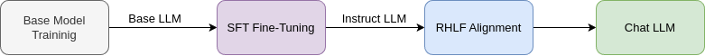
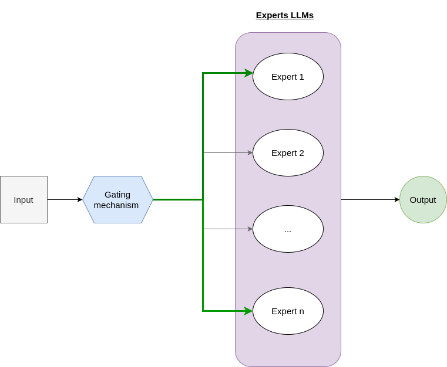
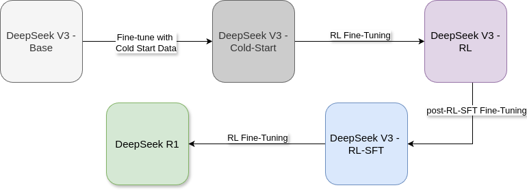

# Introduction

In January 2025, a Chinese startup, called DeepSeek, unveiled its revolutionary AI model, shocking the landscape of artificial intelligence with its outstanding performance compared to its cost. Alongside their model release, they released a mobile app that allows users to chat with the AI model in real-time similar to ChatGPT and Anthropic. Their app has gathered over 10 million downloads on the Google Play Store in less than a month!

Why DeepSeek's R1 gains such popularity? Well, the model delivers an impressive, on-par performance compared to the leading U.S. AI systems like OpenAI's ChatGPT, the most recent O1 version, and Anthropic Claude Sonnet 3.5, if not surpassing it. They deliver such performance with a more than 90% cost reduction! causing a massive disrupt in the markets, leading to erasing $1 trillion in value! Notably, Nvidia, the GPUs chips industry leader, experienced a record-breaking $600 billion loss in market capitalization, marking the largest single-company loss in U.S. stock market history. What is even more interesting is that they published their work as an open-source. The model is published under an MIT license, making it a commercially viable option with proper compute availability. Their experimental work is also well described on published research papers for both of their work: DeepSeek R1 and DeepSeek V3 with all of its previous versions. Making a giant leap for open source progress in the AI race with closed source enterprise.

"**But Wait**" how DeepSeek were able to achieve such impressive performance Given the Chaina's export controls? Note that they claimed that they trained this model on a cluster of 2048 Nvidia H800 GPUs which is less efficient to its powerful sibling: Nvidia H100. It turns out they achieved this by incorporating many training trick and advances. What is even more interesting is the introduction of Reinforcement Learning as an innovative approach to improve the performance. They were the first to show that Reinforcement Learning works at this large scale of LLMs development making a good end for all the previous stories and trials in this direction. In this article, I am going to illustrate how this model was trained with a bit of in-depth technicality. This will also cover how its elder brother DeepSeek V3 are developed as this is important to grasp the full picture. For deep dives, better to give an in-depth read to the developers' technical report they released.

# Preamble and Terminologies

Before star diving further, it is helpful to state the terminologies used so that both of us (me and you) are on landing on a common ground.

## An LLM development Pipeline

The current development of the production-grade LLMs undergoes the following steps:

- Building a massive dataset of text (usually with trillion tokens). This dataset is just a text, like books, articles, high quality web-content, wiki pages, etc.
- Build and train a transformer-based model for the next-token generation objective on the built dataset. The resulting trained model should be smart enough to predict the best next token given a previous sequence of tokens. This model is usually called a base model.
- The base model is taking another round of fine-tuning. This fine-tuning is called supervised fine-tuning or SFT in short. The model in this stage is trained on datasets from downstream natural language processing tasks like question answering, sentiment analysis, machine translation, text classification, language understanding and comprehension. These datasets are usually of special formats having two pairs apart: the input and the output. The model is fine-tuned to produce the output given the input.
- While the model seems to be ready for public use by the last step. However, it undergoes another step, an alignment step. This step is concerned with teaching the model to align its output to human preferences. That is: the model should not produce harmful, offensive, and disrespectful content. The model, in this step, is usually trained with a special process called Reinforcement Learning from Human Feedback (RHLF). The resulting model after this step is a production ready LLM, sometime called Chat model, like ChatGPT. In some cases, this step is merged with the previous step and the model is just called an instruct model where it covers both fine-tuning and alignment steps.

*Figure 1: LLM Development Pipeline*

## MoE architecture

DeepSeek V3 is a Mixture of Experts (MoE) architecture. What does this mean? The Mixture of Experts (MoE) architecture is a design where multiple specialized "expert" LLMs that are trained together. The hypothesis is that each one of these experts is expected to be better and proficient at handling different types of inputs or tasks. During inference where the user interact with the LLM, the MoE architecture will select the expert that is best suited to process the input.

MoE usually trains a gating mechanism that learns to route incoming inputs to the most appropriate expert(s), acting like a smart traffic controller that directs each input to the expert or a group of experts best suited to process it.

*Figure 2: Mixture of Experts Architecture*

Why this architecture is useful? It is useful because it is cost effective during inference time. That is, during training, many experts are trained. However, during inference, only few of them got activated to response to the user queries. DeepSeek architecture is an MoE expert with a total of 671B parameters with only 37B activated during inference.

## Reinforcement Learning

One of the innovations introduced by DeepSeek team is the incorporation of reinforcement learning as a major ingredient to improve the model reasoning abilities. But what is Reinforcement Learning in this context? How it is compared to the other learning paradigms: supervised and unsupervised learning?

Reinforcement learning is a machine learning paradigm where the model improve its abilities by getting punished if made mistakes or rewarded if made the right actions, similar to the "carrot and stick principle" learning approach. This is in contrast to the supervised learning approach where the model sees a lot of input and output pairs and learns to mimic this behavior.

# DeepSeek R1

DeepSeek R1 development pipeline can be very briefly illustrated in the following sequence of steps:

1. SFT Cold Start fine-tuning of DeepSeek V3-Base -> DeepSeek-V3-Cold-Start
2. RL training on DeepSeek-V3-Cold-Start -> DeepSeek-V3-RL.
3. New SFT generated from DeepSeek-V3-Instruct-RL combined with another SFT data generated from DeepSeek-V3-Instruct. Let us call this data post-RL-SFT data.
4. DeepSeek-V3-RL fine-tuning on post-RL-SFT data -> DeepSeek-V3-RL-SFT
5. Finally DeepSeek-V3-RL-SFT undergoes another round of RL training where this step produces **DeepSeek-R1**.

*Figure 3: DeepSeek-R1 development pipeline*

